# 01
## 01-01
预测汽车价格，利用搜集到的特征数据：制造商，品牌，行驶里程等，预测汽车的价格；

## 01-02 rulebased system
- 分类垃圾邮件和普通邮件，定义垃圾邮件的规则：
1. 来自特定邮箱的邮件，定义为‘垃圾邮件’；
2. 邮件标题中包含‘税务审查’等敏感字眼的，定义为‘垃圾邮件’；
3. 来自特定域名的邮件，定义为‘垃圾邮件’；
4. python实现：
def detect_spam(email):
    if email.sender == 'promotions@online.com'
        return SPAM
    if contains(email.title,['tax','rewiew'])
      and  domain(email.sender, 'online.com'):
        return SPAM
    return GOOD
5. 画图表示：
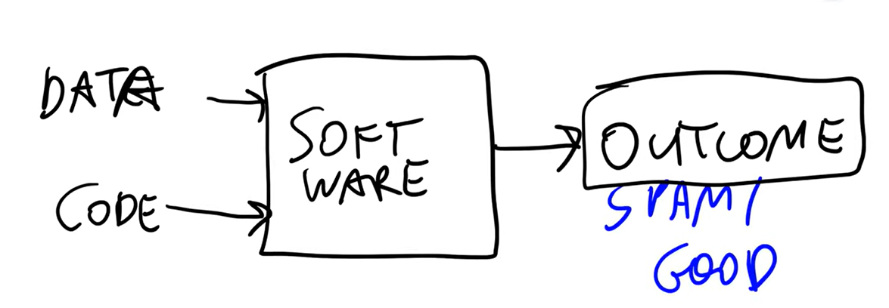
- 问题：
  如果规则初期有效，但是后期，因为规则导致拦截了正常的邮件，我们需要修改和升级规则；
升级规则后，又会出现新的错误拦截，我们继续修改规则，所以拦截垃圾邮件的规则一直在变化，规则
代码一直在膨胀，且有些代码已经失效，所以维护代码的工作会变成噩梦。
- 解决问题的办法：**ML**
1. 获取尽可能多的电子邮件；
2. 分析及获取电子邮件的特征（问题中的**各种规则就是特征**）；
3. 用特征数据，训练模型；
4. 训练完成后，用模型来区分垃圾邮件和非垃圾邮件。
5. 二元特征：yes or  no
6. 如果检测一封邮件中对应特征的情况，用数组表示，数组中的每个值，对应1个特征规则
[0,1,1,1,0] 0表示特征不匹配，1表示特征匹配，这是-- **features data**
由features data，可以推导出**期望输出****目标变量**：1
7. 特征值（特征向量）+目标变量（标签向量）=**数据集**    --就是**训练数据**
如图：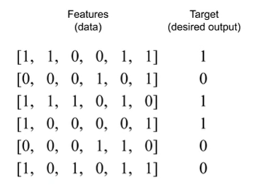
在机器学习中，算法 接收的确实是特征向量（Feature Vectors）+标签向量，而不是原始邮件文本本身。每一封邮件会被转化为一个数值化的向量。
8.用这些数据集，训练模型
把这些数据，输入到机器学习算法 中，有时我们把这个**训练过程称为拟合**，这就是训练1个模型。
然后得到1个模型，用这个模型，去预测邮件是否为垃圾邮件。
上面图中，每一行，都是一封邮件内容对应规则的数据集结果。
9.模型，由输入的特征值**features data**，输出的是概率值
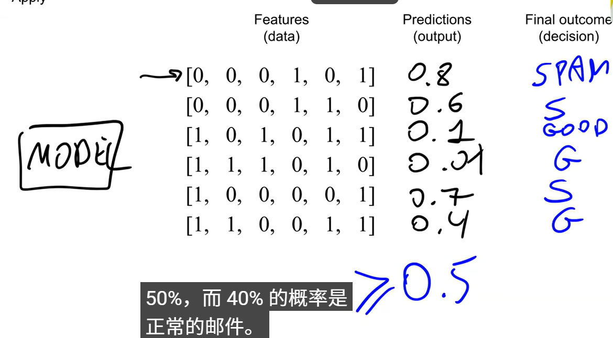
如上图，模型预测的是概率值，然后根据设定的阈值0.5，得到最终判断结果：是否是垃圾邮件。
最终，预测为垃圾邮件的，都会进入垃圾邮件文件夹，所有正常邮件都会进入收件箱。
10. 从机器学习算法到模型的过程
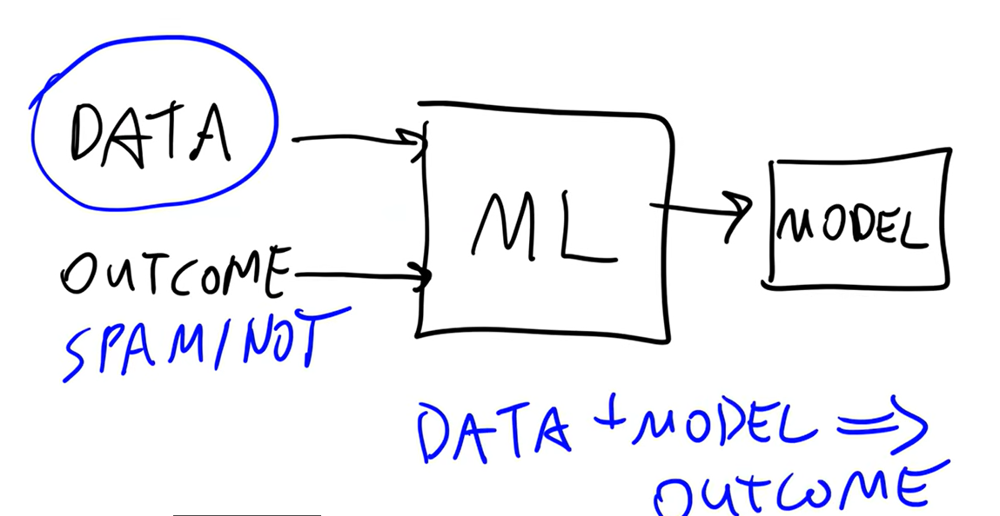

## 01-03 Supervised Machine Learning  **监督学习** 
垃圾邮件预测和价格预测，都是监督学习的范畴。
### 比如预测骑车价格
我们向模型展示：不同的汽车，每辆汽车的价格等等数据
这就是监督了算法，也就是机器。

***features data***通常用**大写字母X**来表示，叫做**特征矩阵**
***目标变量（标签向量）***通常用**小写字母y**来表示

g（X）  -- 这个就是训练函数，或者叫做训练算法，训练的要求就是，结果尽可能接近目标变量y。
g 算法 **接收特征矩阵**获得一个近似于**目标变量y**的值。如图：
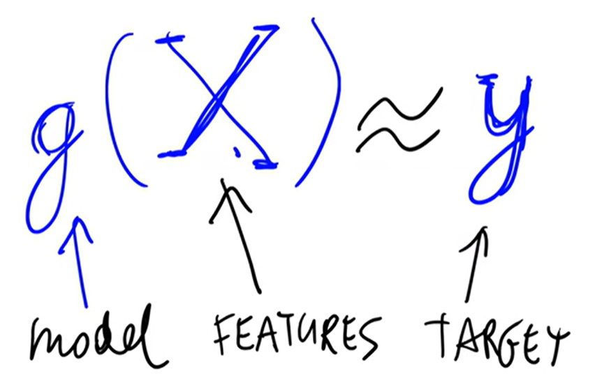
以上描述，就是监督学习的目标：y可以是汽车的价格，X是汽车的品牌，型号，里程等等。
如果是垃圾邮件的预测，那么X就是邮件内容中的一些重要特征的值，y就是垃圾邮件的概率。

--1**回归**  预测汽车价格的**监督学习**方式，属于**regression回归**分类
汽车价格本身（如15.5万），这是一个连续的、无界的数值 → 回归问题。
--2**分类**  当g函数的输出，不是一个数字，而是1个类别时，就属于**监督学习**的**分类方式**
比如，垃圾邮件识别，最终通过输出垃圾邮件概率的数字，来判断是否是垃圾邮件，这就是分类。概率值只是中间结果，不是最终结果，得到最终结果，需要使用阈值判断概率值，得出是否是垃圾邮件的二元结果。
这是一种二元分类，是一种特殊分类，如下图，g函数的结果y，总是介于0-1之间。
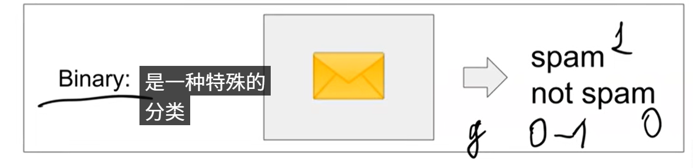
-- 当然还有1种分类，多类别/子类别，如图，可以根据需要，设定无数种的类别
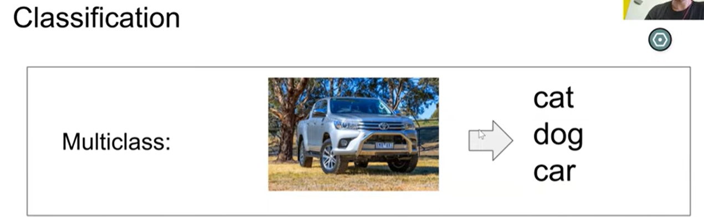

--3**排序**
通常用于推荐系统；
它通过分析你（用户）和物品（商品、视频、文章等）之间的历史行为数据，计算出一个匹配分数，然后把这个分数最高的几类物品推给你。
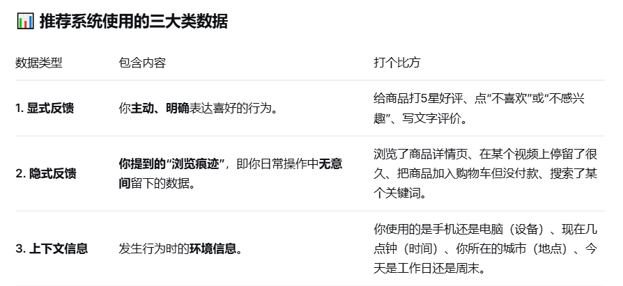

回归就像是**填空题**；分类就像是**选择题**；排序类的
推荐系统，就像是一道***“排序题”或“连线题”***。

## 01-04  CRISP-DM  ML Process
这是 methodology for organizing ML projects 机器学习项目组织方法论
CRISP-DM(Cross Industry Standard Processing Data Mining)跨行业标准处理-数据挖掘
### DM
下图，是数据挖掘行业标准流程
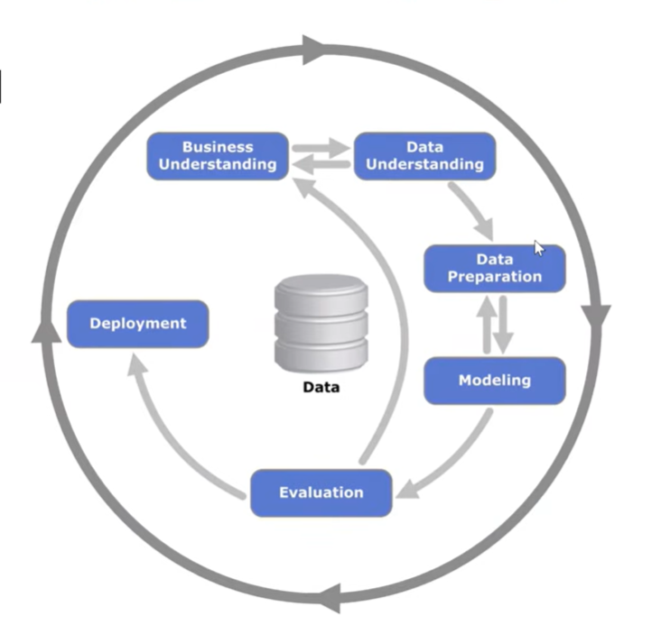
数据挖掘：它是机器学习项目组织方式的指导方法。

### 使用垃圾邮件检测  来举例  
尝试把垃圾邮件检测示例，映射到这个DM的方法论中。
- **第一步：业务理解**
确定我们要解决的问题，我们要理解问题，了解问题的重点，这会决定项目的成功。
这个时候要问1个问题：我们真的需要机器学习吗？因为对于很多问题，我们根本不需要机器学习。
我们需要思考，机器学习，是否是这个问题的正确方案，也许只是需要开发1个规则系统或者是开发一些启发式算法，而无需投入大量资源来开发机器学习系统。
需要有1个衡量机器学习效果的指标。KPI
- **第二步：数据理解**
Data understanding
Identify the data sources
We have a report spam button
Is the data behind this button good enough?
Is it reliable?
Do we track it correctly?
Is the dataset large enough?
Do we need to get more data?
识别数据来源  
我们有一个报告垃圾邮件的按钮  
这个按钮背后的数据是否足够可靠？  
它是否可信？  
我们是否正确地进行了追踪？  
数据集是否足够大？  
我们是否需要获取更多数据？

如果确定我们理解了问题，并且找到了衡量成功的方法，需要机器学习来解决问题，那么
我们就需要了解，实际有哪些数据可以用来解决问题。
因为机器学习，真的需要数据，如果没有数据，就无法进行任何机器学习。
所以，这一步，我们必须确保数据可用，如果不可用，我们需要了解如何获取数据，
需要手动分析数据质量，保证没有缺失的数据。
需要确保有足够量的数据用于机器学习训练。
- **第三步：数据准备** 
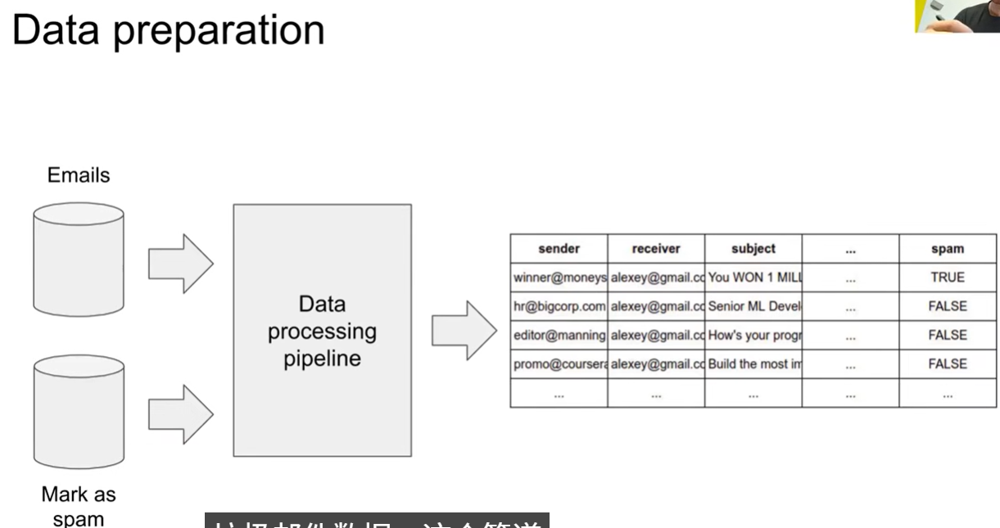
1.清洗数据clean data，
我们已经分析了数据，知道数据是可靠的，可以使用，并且数据量足够大。
我们这一步进行数据转换，进行特征化，并且清理数据，**去除所有噪声**

2.创建管道 build the pipelines
就是用来完成上一步清洗数据的工具，如图：
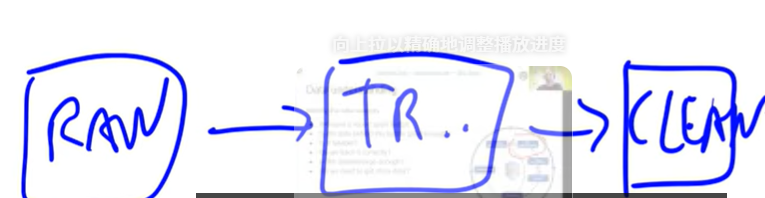

3. 转换为表格形式convert into tabular form
这里将干净的数据进行表格形式的转换，然后，然后**用于机器学习的模型训练**。
上图中的**spam列，就是目标变量**
上图中的除spam列外的其他列，就构成了特征矩阵，然后将对应的特征值，转换为 1，0 的模式，如下图：
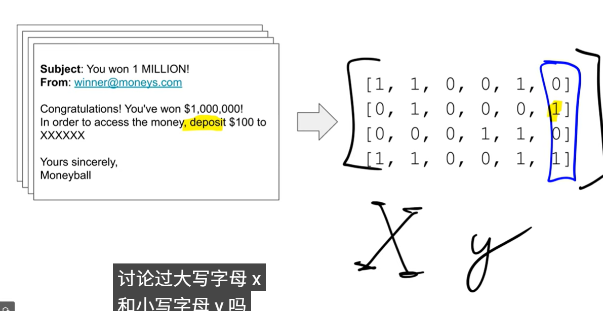

- **第四步：训练模型**
***Modeling*** --也叫机器学习算法
Which model to choose?
Logistic regression 
Decision tree
random tree
random forest
Neural network
Or many others

选择不同的模型，选择最佳的模型，机器学习真正发生的地方。
选择哪种模型？  
**逻辑回归** **决策树** **随机树**  **随机森林** **神经网络** 或**其他多种**

- **第五步：评估**
***Evaluation***
Is the model good enough?
Have we reached the goal?
Do our metrics improve?
Goal: Reduce the amount of spam by 50%
Have we reduced it? By how much?
(Evaluate on the test group)

Do a retrospective:
Was the goal achievable?
Did we solve/measure the right thing?
After that, we may decide to:
Go back and adjust the goal
Roll the model to more users/all users
Stop working on the project
Is the data behind this button good enough?
Is it reliable?
Do we track it correctly?
Is the dataset large enough?
Do we need to get more data?
**评估** 
模型是否足够好？  
我们是否达成了目标？  
我们的指标是否有所改善？  
目标KPI：将垃圾信息减少50%  
我们是否实现了这一目标？减少了多少？  
（在测试组上进行评估）

进行回顾：
目标是否可实现？
我们是否解决了/测量了正确的问题？  
之后，我们可能会决定：  
返回并调整目标  
将模型扩展到更多用户/所有用户  
停止项目开发

**如果一切顺利，我们进行到最后一步，部署**

--**第六步 部署 deployment**
Evaluation + Deployment
Often happens together:
Online evaluation: evaluation of live users
It means: deploy the model, evaluate it
评估 + 部署  
通常同时进行：  
在线评估：对实时用户进行评估  
含义：部署模型，对其进行评估
评估模型和部署模型通常是同时进行的，因为评估模型的方式，通常是通过部署来实现的。

Roll the model to all users
Proper monitoring
Ensuring the quality and maintainability
将模型推广给所有用户  
完善监控  
确保质量和可维护性

--**第七步：迭代 Iterate!**
Iterate!
ML projects require many iterations!
机器学习项目，需要更多的迭代
因为机器学习项目需要不断改进。

Start simple
Learn from feedback
Improve
从简单开始  
借鉴反馈  
持续改进

### 总结!
如图：
[1784376861848](image/学习记录/1784376861848.png)
Summary
Business understanding: define a measurable goal. Ask: do we need ML?
Data understanding: do we have the data? Is it good?
Data preparation: transform data into a table, so we can put it into ML
Modelling: to select the best model, use the validation set
Evaluation: validate that the goal is reached
Deployment: roll out to production to all the users

**摘要**
业务理解：明确可衡量的目标。问自己：我们是否需要机器学习？  
数据理解：我们是否有可用的数据？数据质量如何？  
数据准备：将数据转换为表格格式，以便输入机器学习模型。  
建模：选择最佳模型，并使用验证集进行评估。  
评估：验证目标是否达成。  
部署：将模型部署到生产环境，供所有用户使用。

## 01-05 Modelling step:Model Selection
讨论建模步骤，如何选择最佳模型，就是模型的选择过程
### 方法
训练模型的时候，**把80%的数据集用于训练**，**隐藏20%**，然后通过这20%（验证数据集），来验证模型效果。
如图：
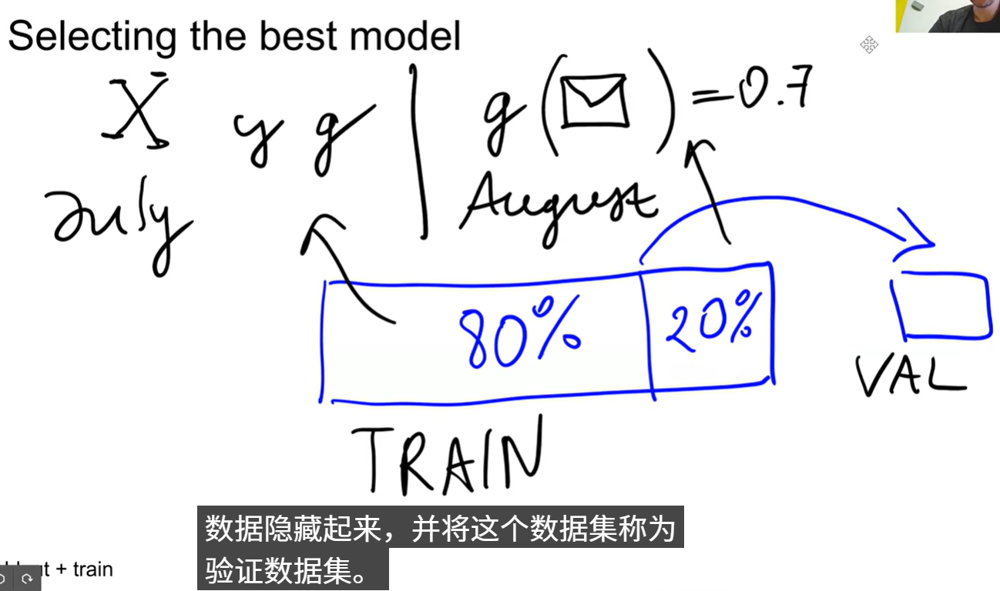
如下图：20%数据集验证模型效果，模型准确率为66%
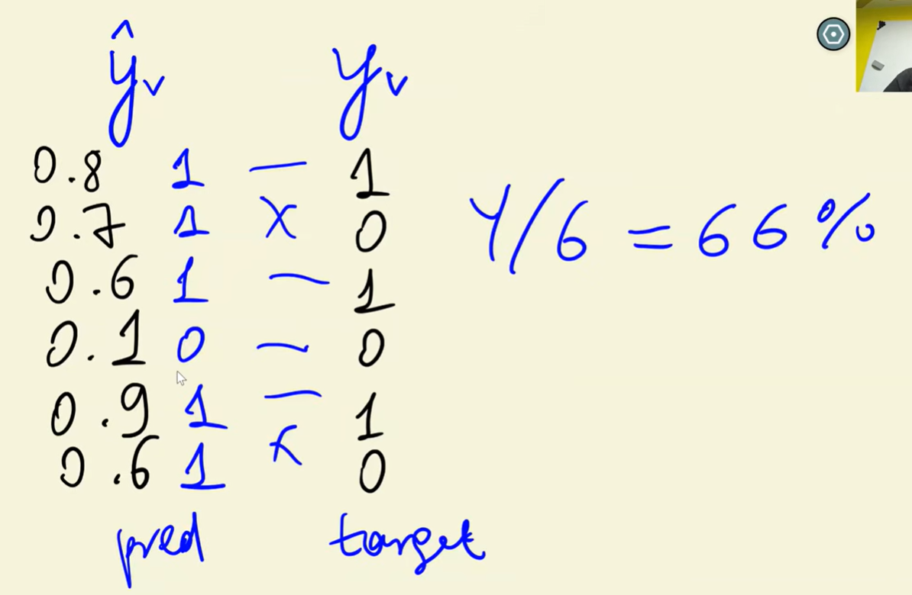
如何选择最合适的模型，如下图：
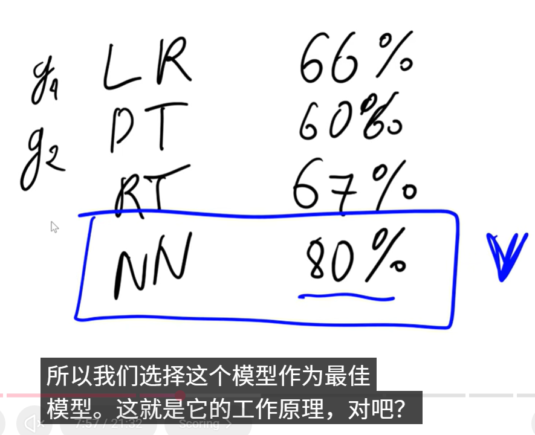

### 问题：multiple comparisons problem  
--**多重比较谬误**
  我们多次进行相同的比较，当我们使用许多不同的模型，并用相同的验证数据评估他们时，
其中1个模型可能会莫名其妙地走运，产生很好的结果。这种情况，在机器学习中经常发生，
因为这些方法，本质上是概率性的，所以可能会出现模型侥幸成功的情况。
如图：硬币代表不同的模型，**NN模型**，就成为了上面所述的**幸运者**
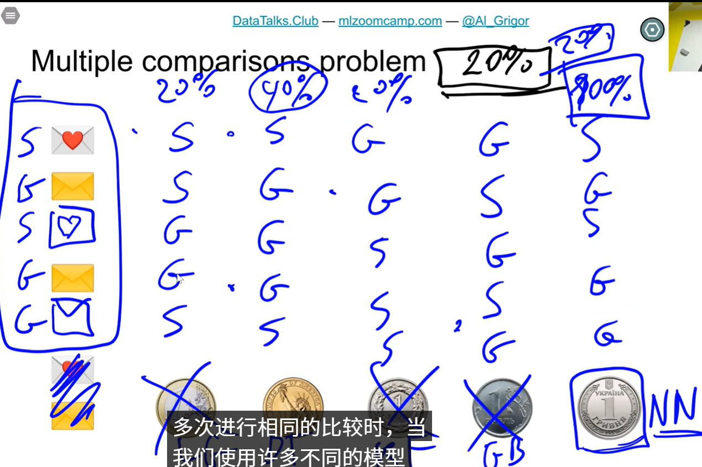
--**规避方法**
  为了避免这种情况，我们**不是**只保留**1个数据集**，**而是**保留**2个数据集**
如图：
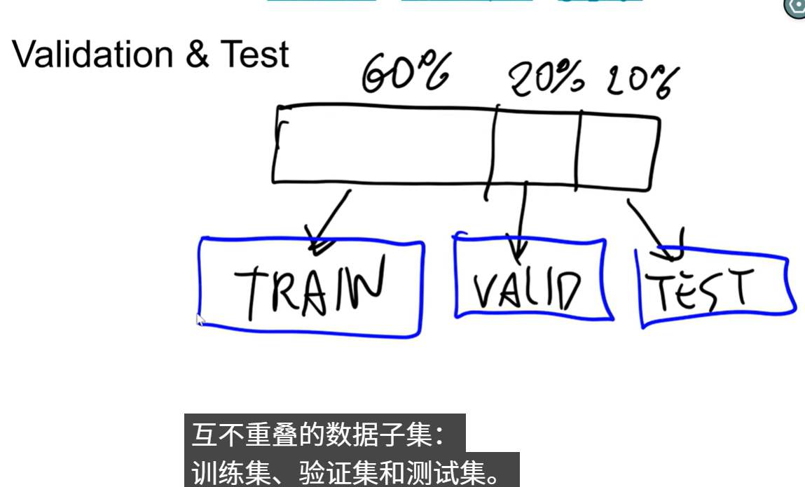
要分60%训练集，20%验证机，20%测试集
如下图：用验证过程的最佳模型NN，再次在测试环节，利用20%的测试集数据，进行测试
来确认NN是否是最佳模型。
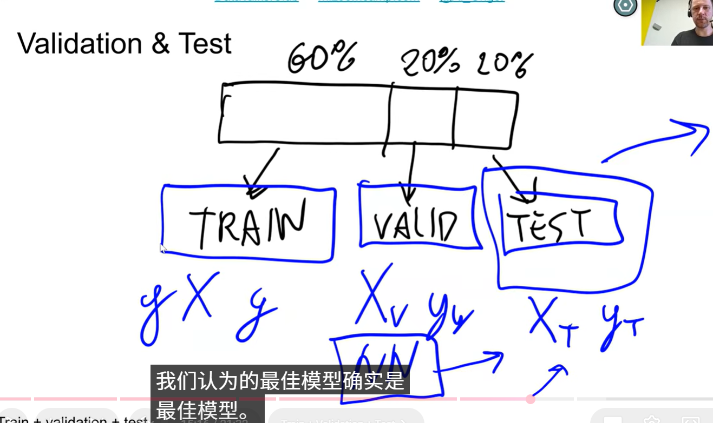
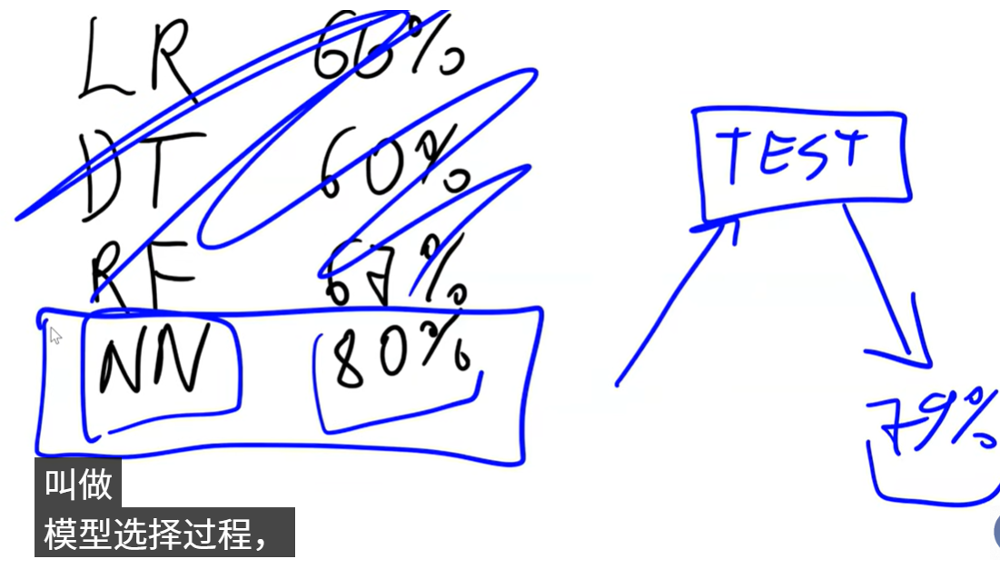

## 实现上述方法的步骤
- 第一步  split   分割数据集，分成3部分
- 第二步  train   训练1个模型 
- 第三步  validation  验证模型
有三个数据集：第1个是**训练集**，第2个**验证集**，第3个**测试集**
训练模型，然后将模型应用于验证数据集，记录准确率和模型性能。
- 第四步  选择最优的模型。
- 第五步  对最优的模型，进行测试，**确保模型没有侥幸成功**。通常需要4-5次
- 第六步  检查

## 01-06 numpy
构建1个评估信用风险评分的模型。

# 02  car price 项目实战心得 
-- Machine Learning for Regression   机器学习--回归模型 
## 01 作业流程
1. **数据下载**
我用的是API，去kangle下载的。
如果不用API,就需要去 Alexey 老师的github上，用wget把数据下载到本地，因为他github中有完整的数据。

2. 将**数据移动**到，指定的目录，方便程序读取，一般是csv格式的数据；

3. **数据准备**：
- 读取数据；
- 将dataframe格式的数据的列名，都统一小写，替换掉空格；
- 将表中，列的str类型列找出来，将列中的所有内容格式化处理：全小写和空格替换下划线；

4. **数据分析**：
- 查看**数据的长尾效应结果**，**数据**是数据表中的：**目标变量/标签向量**，就是y值
- 查看**数据的对数值的正态分布效果**
**注意**：使用price_logs = np.log1p(df.msrp)  这种方式，更准确，避免价格等于0时候，函数崩溃报错
- 查看**数据的空值统计情况**，做到心理有数
注意：这里不处理空值
5. **配置验证框架**
将数据拆分成 **60% 的训练数据**，**20%的验证数据**，**20%的测试数据**
- 首先算出三部分数据，各需要总数据表中的多少行
- 把数据表打乱
- 给三部分数据，分配对应的数据  df_train,df_val,df_test
- 三部分数据重建索引
- 将三部分数据中的**y值全部提取出来**，形成 y_train,y_val,y_test
- 将三部分数据中的**y值列全部删除掉**

6. 线性回归算法理解
特征值X的矩阵，去乘以，特征值的权重向量W,然后得到y值，就是预测值。
**注意**：因为权重向量，包含了截距值，所以，X矩阵必须加1列值成为第1列，且全部是1
因为，这个1，要与截距值相乘，这样会保持截距值不变

7. 截距值  权重值  求解函数
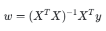
形成  train_linear_regression(X,y) 函数

8. 特征值X的求解函数
找到要利用的特征值，将其们作为特征数据的组成部分
base = ['engine_hp','engine_cylinders','highway_mpg','city_mpg','popularity']
def prepare_X(df):
    df_num = df[base]  # 提取特征列数据
    df_num = df_num.fillna(0)  #对数据空值进行填充
    X= df_num.values  # 转换成numpy类型，
    return X

9. 有了特征值X 和 权重值求解函数
就可以计算预测值，然后可以和原有y值做对比，可以利用histplot直方图进行对比。

10. **RMSE 均方根误差**
利用这个函数，可以计算**预测值**和**实际y值**得**误差率**
这个误差率是个**对数值**，可以通过np.exp() 来求解对数值，得到实际的误差率

11. 用val 验证数据去 **验证模型**
利用验证数据，做如下步骤：
X_train = prepare_X(df_train)
w0,w = train_linear_regression(X_train,y_train)

X_val = prepare_X(df_val)
y_pred = w0 + X_val.dot(w)
rmse(y_val,y_pred)   # 输出均方根误差，

将均方根结果与训练数据得均方根结果对比，看看两者之间误差是否合理？

12. 特征工程--分类变量
除了上述base中得5个特征，还有其他得特征可以纳入到特征数据中，但需要做处理。

其中有些特殊得分类变量，比如：**车辆得门数，车辆得年限**，
1).车辆得门数，需要根据不同得门数类型，做判断，然后生成1或0
2). 车辆年限，需要用当前时间-车辆出厂时间，
3). 其他特征如下：把他们全部列入特征数据
categorical_variables = ['make','engine_fuel_type','transmission_type','driven_wheels','market_category','vehicle_size','vehicle_style'] 

这一步做完，通常会发现，rmse值非常夸张，权重值也已经严重偏离了实际。

13. 规范化 Regilarization  微调模型 tuning the model
- 就是控制权重值，不要偏差太大 
- 就是通过参数，控制方阵中数据重复列

for r in [0.0,0.00001,0.0001,0.001,0.01,0.1,1,10]:
    X_train = prepare_X4(df_train)
    w0,w = train_linear_regression_reg(X_train,y_train,r=r)
    
    X_val = prepare_X4(df_val)
    y_pred = w0 + X_val.dot(w)
    score = rmse(y_val,y_pred)

    print(r,w0,score)

14. 应用模型 Using the model
个人对于目前学习中Using the model的一个小小的体会：
alexey 老师，通常是把测试数据集中的某一行数据，拿出来，传给模型，让模型输出结果，然后看结果与测试数据集中，原有y值是否相同。
这也可以理解为，老师方便验证教学成果的方式。也有助于我们理解，未来有新得数据数据要使用模型输出结果，就可以参照这种方式进行。
这一块，没有太多要说得。

# 03 完成了churn  prediciton项目
这里不再赘述流程。

# 04 阶段总结回顾一下
### 跟着alexey老师，完成了
- 车辆价格预测所有代码得编写和学习理解；主要是对线性回归得机器学习理解和实现方式得理解。
- 用户流失率越策得杜松有代码得编写和学习理解，对线性回归，逻辑回归有了更深得理解。

以上内容，学习到了，数据处理，模型构建，模型验证、测试，及模型应用得所有环节，理解了线性回归和逻辑回归这种最常见得机器学习中得监督学习

# 05 继续学习，开始新得环节：**模型得评估**
Evaluation   Metrics : session  overview 
需要学习，如何判断模型得良好

